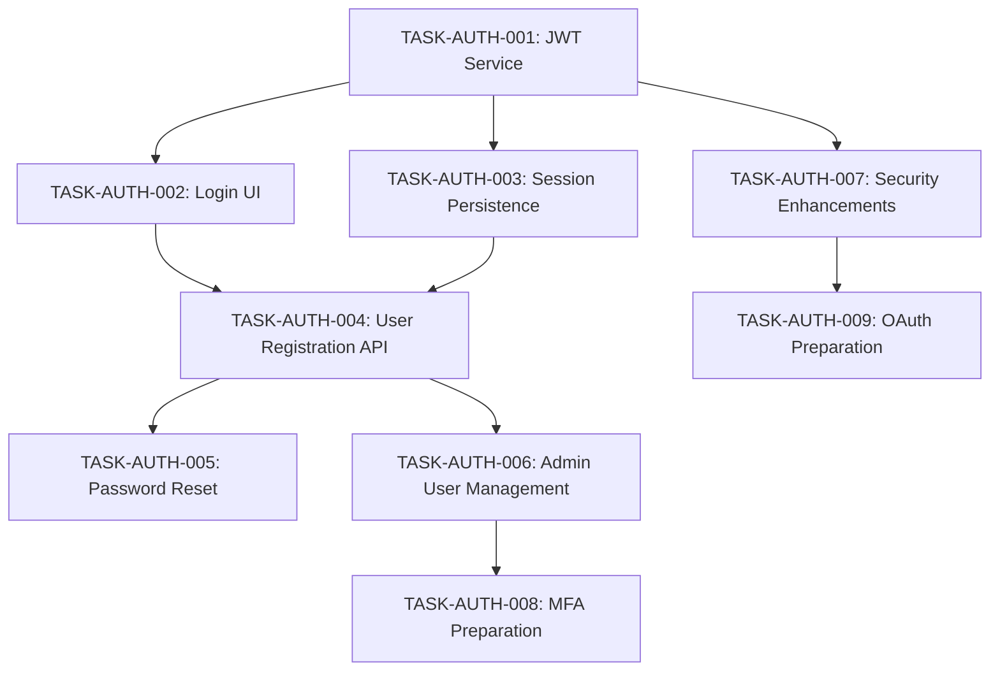

# Authentication System - Task Backlog

**Feature:** Authentication System  
**Priority:** Critical (Core Infrastructure)  
**Estimated Effort:** 3-4 weeks  

## Epic: Core Authentication Implementation

### High Priority Tasks (Sprint 1)

#### TASK-AUTH-001: JWT Service Enhancement
**Priority:** P0 (Critical)  
**Effort:** 3 days  
**AC Reference:** AC-AUTH-001, AC-AUTH-004  
**Description:** Enhance existing JWT service with proper token expiration, refresh, and validation  

**Acceptance Criteria:**
- JWT tokens include user ID, role, and 24h expiration
- Token validation middleware rejects expired tokens
- Refresh token mechanism implemented
- Server-side token blacklist for logout

**Files to Modify:**
- `src/features/auth/services/jwt.service.ts`
- `src/features/auth/middleware/auth.middleware.ts`
- `src/features/auth/types/jwt.types.ts`

#### TASK-AUTH-002: Login UI Component
**Priority:** P0 (Critical)  
**Effort:** 2 days  
**AC Reference:** AC-AUTH-001, AC-AUTH-002  
**Description:** Create responsive login page with form validation and error handling  

**Acceptance Criteria:**
- Login form with email/password fields
- Client-side validation for required fields
- Error message display for invalid credentials
- Loading state during authentication
- Accessible keyboard navigation

**Files to Create:**
- `src/web/client/pages/LoginPage.tsx`
- `src/web/client/components/LoginForm.tsx`
- `src/web/client/components/__tests__/LoginForm.test.tsx`

#### TASK-AUTH-003: Session Persistence
**Priority:** P0 (Critical)  
**Effort:** 2 days  
**AC Reference:** AC-AUTH-003  
**Description:** Implement session persistence using localStorage with security considerations  

**Acceptance Criteria:**
- JWT token stored securely in localStorage
- Automatic token validation on app startup
- Session restoration on browser restart
- Token cleanup on logout

**Files to Modify:**
- `src/web/client/contexts/AuthContext.tsx`
- `src/web/client/services/auth.service.ts`

### Medium Priority Tasks (Sprint 2)

#### TASK-AUTH-004: User Registration API
**Priority:** P1 (High)  
**Effort:** 3 days  
**AC Reference:** AC-AUTH-005  
**Description:** Admin-only user registration API with validation  

**Acceptance Criteria:**
- POST /api/auth/register endpoint (admin only)
- Password strength validation
- Email uniqueness validation  
- User account creation with proper hashing
- Input sanitization and validation

**Files to Create:**
- `src/features/auth/routes/registration.routes.ts`
- `src/features/auth/services/user.service.ts`
- `src/features/auth/validators/user.validator.ts`

#### TASK-AUTH-005: Password Reset Flow
**Priority:** P1 (High)  
**Effort:** 4 days  
**AC Reference:** AC-AUTH-004  
**Description:** Secure password reset with email verification (email service placeholder)  

**Acceptance Criteria:**
- Password reset request API
- Secure reset token generation
- Reset token validation and expiration
- New password update with validation
- Email placeholder service integration

**Files to Create:**
- `src/features/auth/routes/password-reset.routes.ts`
- `src/features/auth/services/password-reset.service.ts`
- `src/web/client/pages/PasswordResetPage.tsx`

#### TASK-AUTH-006: Admin User Management UI
**Priority:** P1 (High)  
**Effort:** 5 days  
**AC Reference:** AC-AUTH-005  
**Description:** Admin interface for user CRUD operations  

**Acceptance Criteria:**
- User list with search and filtering
- Create user modal with form validation
- Edit user details and role assignment
- Deactivate/reactivate user accounts
- Audit log of user management actions

**Files to Create:**
- `src/web/client/pages/admin/UserManagementPage.tsx`
- `src/web/client/components/admin/UserList.tsx`
- `src/web/client/components/admin/CreateUserModal.tsx`

### Low Priority Tasks (Sprint 3)

#### TASK-AUTH-007: Security Enhancements
**Priority:** P2 (Medium)  
**Effort:** 3 days  
**Description:** Rate limiting, brute force protection, and security logging  

**Acceptance Criteria:**
- Rate limiting on login attempts (5 attempts per 15 minutes)
- Account lockout after repeated failures
- Security event logging
- IP-based brute force detection

#### TASK-AUTH-008: Multi-Factor Authentication Preparation
**Priority:** P3 (Low)  
**Effort:** 2 days  
**Description:** Database schema and API structure for future MFA implementation  

**Acceptance Criteria:**
- User table supports MFA preferences
- TOTP secret storage structure
- MFA API endpoint placeholders
- Documentation for future implementation

#### TASK-AUTH-009: OAuth Integration Preparation  
**Priority:** P3 (Low)  
**Effort:** 3 days  
**Description:** Architecture and interfaces for future OAuth provider integration  

**Acceptance Criteria:**
- OAuth provider interface definition
- User account linking strategy
- Configuration structure for OAuth providers
- Migration plan from custom auth

## Task Dependencies

## Sprint Planning

### Sprint 1 (Week 1-2): Core Authentication
- TASK-AUTH-001: JWT Service Enhancement
- TASK-AUTH-002: Login UI Component  
- TASK-AUTH-003: Session Persistence
- **Goal:** Basic login/logout functionality working

### Sprint 2 (Week 3-4): User Management
- TASK-AUTH-004: User Registration API
- TASK-AUTH-005: Password Reset Flow
- TASK-AUTH-006: Admin User Management UI
- **Goal:** Complete user lifecycle management

### Sprint 3 (Week 5-6): Security & Future-Proofing  
- TASK-AUTH-007: Security Enhancements
- TASK-AUTH-008: MFA Preparation
- TASK-AUTH-009: OAuth Preparation
- **Goal:** Production-ready security and extensibility

## Definition of Done

Each task must meet these criteria:
- [ ] Code implementation complete
- [ ] Unit tests written and passing (>90% coverage)
- [ ] Integration tests for API endpoints
- [ ] Component tests for UI elements
- [ ] Accessibility testing completed
- [ ] Security review completed
- [ ] Documentation updated
- [ ] Acceptance criteria verified
- [ ] Code review approved
- [ ] QA testing completed