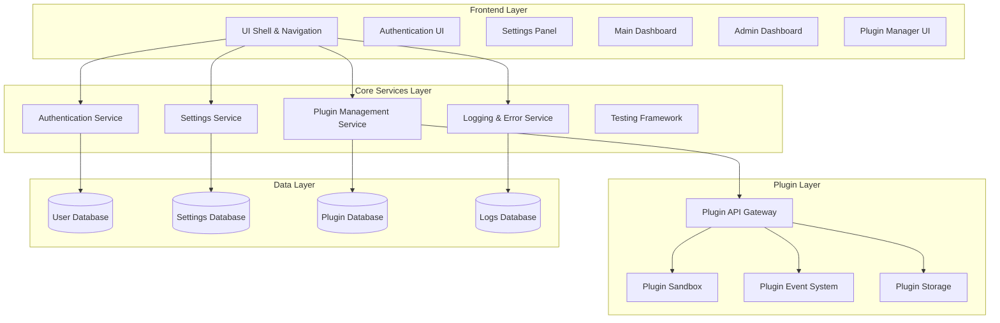

# Status: COMPLETED (2025-01-26)
# Implementation: See /src/ directory - backend services and interfaces implemented

# NeutralApp Design Document

## Overview

NeutralApp is designed as a domain-agnostic, ultra-modular application shell that serves as the foundation for any user-facing application. The architecture prioritizes modularity, security, and developer experience through a robust plugin system, comprehensive error handling, and automated testing framework.

The core philosophy is to provide only essential functionality (authentication, settings, admin dashboard, plugin management, and UI shell) while enabling all other features through a secure, well-defined plugin architecture. This approach ensures maximum flexibility while maintaining system stability and security.

## Architecture

### High-Level Architecture



### Design Principles

1. **Modularity First**: Core system provides minimal functionality; everything else is plugin-based with clear separation of concerns
2. **Don't Reinvent the Wheel**: Leverage proven, battle-tested solutions (Supabase Auth, established UI libraries, standard protocols)
3. **AI-Agent Friendly**: Structured APIs, predictable behavior patterns, and clear documentation for AI agent integration
4. **Prebuilt Solutions**: Use existing libraries and services where they provide reliable, maintained functionality
5. **Security by Design**: Plugin sandboxing and API restrictions prevent unauthorized access
6. **Fail-Safe Operation**: System continues operating even when individual plugins fail
7. **Developer Experience**: Clear APIs, comprehensive error handling, and automated testing

## Components and Interfaces

### Authentication System

**Design Decision**: Supabase Auth for authentication with email verification and session management. This provides enterprise-grade security, email verification workflows, and eliminates the need to build custom authentication infrastructure.

**Rationale**: 
- Supabase Auth handles complex security concerns (password hashing, rate limiting, email verification)
- Built-in session management with automatic token refresh
- Row Level Security (RLS) integration
- Reduces development time and security risks
- Supports secure session persistence and expiration handling
- Meets requirements for secure registration, login, session management, and email verification

**Components**:
- `AuthenticationService`: Wrapper around Supabase Auth client with registration, login, and logout functionality
- `SessionManager`: Manages Supabase session state, expiration, and user context preservation with destination tracking
- `AuthProvider`: React context provider for authentication state
- `AuthGuard`: Route protection component that handles session validation and redirects
- `AuthUI`: Registration and login interface components with error handling

**Key Interfaces**:
```typescript
interface AuthenticationService {
  signUp(email: string, password: string, metadata?: UserMetadata): Promise<AuthResult>
  signIn(email: string, password: string): Promise<AuthResult>
  signOut(): Promise<void>
  resetPassword(email: string): Promise<void>
  updatePassword(newPassword: string): Promise<void>
  getCurrentUser(): User | null
  onAuthStateChange(callback: (user: User | null) => void): () => void
  validateCredentials(email: string, password: string): Promise<ValidationResult>
  displayRegistrationAndLogin(): void
  sendEmailVerification(email: string): Promise<void>
}

interface SessionManager {
  getSession(): Session | null
  refreshSession(): Promise<Session | null>
  isAuthenticated(): boolean
  getUserProfile(): Promise<UserProfile | null>
  handleSessionExpiry(intendedDestination?: string): void
  preserveDestination(path: string): void
  getPreservedDestination(): string | null
  terminateSession(): Promise<void>
  clearAuthTokens(): void
}
```

### Plugin Management System

**Design Decision**: Plugin lifecycle management with dependency resolution, safe loading/unloading, and comprehensive plugin discovery interface.

**Rationale**:
- Plugin marketplace interface allows users to discover and evaluate plugins before installation
- Dependency resolution prevents plugin conflicts and ensures proper loading order
- Safe sandboxing prevents plugin failures from affecting core system stability
- Graceful error handling maintains system operation when individual plugins fail
- Automatic dependency resolution simplifies plugin installation for users
- Plugin verification ensures security and compatibility before activation

**Components**:
- `PluginManager`: Core plugin lifecycle management with installation, activation, and removal
- `PluginRegistry`: Maintains plugin metadata, dependencies, and ratings
- `PluginLoader`: Handles safe plugin loading, sandboxing, and error isolation
- `DependencyResolver`: Resolves and manages plugin dependencies automatically
- `PluginMarketplace`: Interface for browsing, rating, and discovering available plugins
- `PluginVerifier`: Validates plugin integrity and compatibility before installation

**Key Interfaces**:
```typescript
interface PluginManager {
  getAvailablePlugins(): Promise<PluginInfo[]>
  installPlugin(pluginPackage: PluginPackage): Promise<InstallResult>
  enablePlugin(pluginId: string): Promise<void>
  disablePlugin(pluginId: string): Promise<void>
  uninstallPlugin(pluginId: string, cleanupData?: boolean): Promise<void>
  getInstalledPlugins(): Promise<PluginInfo[]>
  resolveDependencies(pluginId: string): Promise<PluginDependency[]>
  downloadAndVerifyPlugin(pluginId: string): Promise<PluginPackage>
  handlePluginFailure(pluginId: string, error: Error): void
}

interface PluginAPI {
  registerUIComponent(component: UIComponent): void
  registerSettingsSchema(schema: SettingsSchema): void
  registerDashboardWidget(widget: DashboardWidget): void
  emitEvent(event: PluginEvent): void
  subscribeToEvent(eventType: string, handler: EventHandler): void
  getPluginStorage(): PluginStorage
  logSecurityViolation(violation: SecurityViolation): void
}
```

### Settings Management

**Design Decision**: Hierarchical settings with plugin integration, real-time validation, and corruption recovery.

**Rationale**:
- Immediate validation and persistence ensures settings consistency
- Plugin settings integration provides unified configuration experience
- Fallback to defaults with user notification handles corruption gracefully
- Hierarchical structure supports both core and plugin-specific settings

**Components**:
- `SettingsService`: Core settings management with validation and persistence
- `SettingsValidator`: Validates setting changes with plugin-specific rules
- `PluginSettingsIntegrator`: Integrates plugin settings into main settings panel
- `SettingsRecovery`: Handles corrupted settings and fallback mechanisms

**Key Interfaces**:
```typescript
interface SettingsService {
  getSetting<T>(key: string): Promise<T | null>
  setSetting<T>(key: string, value: T): Promise<void>
  getPluginSettings(pluginId: string): Promise<Record<string, any>>
  setPluginSetting(pluginId: string, key: string, value: any): Promise<void>
  resetToDefaults(scope?: string): Promise<void>
  validateSetting(key: string, value: any): Promise<ValidationResult>
  recoverCorruptedSettings(): Promise<RecoveryResult>
}
```

### UI Shell and Navigation

**Design Decision**: Component-based UI with plugin integration points and responsive design using established UI libraries (React, Material-UI/Chakra UI).

**Rationale**:
- Consistent navigation structure provides predictable user experience across all plugins
- Plugin integration points allow seamless extension of navigation functionality
- Responsive design ensures usability across desktop and mobile devices
- Navigation state management enables smooth transitions and proper routing
- Fallback interfaces maintain functionality when plugin UI components fail
- Established UI libraries provide battle-tested components and accessibility compliance

**Components**:
- `NavigationManager`: Manages navigation state and routing
- `UIComponentRegistry`: Registers and manages plugin UI components
- `LayoutManager`: Handles responsive layout and component positioning
- `ThemeManager`: Manages application theming and plugin theme integration
- `ThemeManager`: Manages application theming and plugin theme integration

**Key Interfaces**:
```typescript
interface UIComponentRegistry {
  registerComponent(component: UIComponent, location: ComponentLocation): void
  unregisterComponent(componentId: string): void
  getComponentsForLocation(location: ComponentLocation): UIComponent[]
}

interface NavigationManager {
  registerRoute(route: RouteDefinition): void
  navigate(path: string, state?: any): void
  getCurrentRoute(): RouteInfo
  setNavigationGuard(guard: NavigationGuard): void
}
```

### Main Application Dashboard

**Design Decision**: Plugin-driven dashboard with configurable layout and fallback content for empty states.

**Rationale**:
- Dashboard serves as the primary user interface, displaying content from installed plugins
- Configurable layout allows users to customize their experience
- Welcome screen guides new users through plugin installation
- Graceful degradation ensures dashboard remains functional when plugins fail

**Components**:
- `DashboardManager`: Orchestrates dashboard layout and plugin widget integration
- `WidgetRegistry`: Manages plugin-provided dashboard widgets and components
- `LayoutEngine`: Handles responsive dashboard layout and user customization
- `WelcomeScreen`: Displays onboarding content when no plugins are installed

**Key Interfaces**:
```typescript
interface DashboardManager {
  registerWidget(widget: DashboardWidget): void
  unregisterWidget(widgetId: string): void
  getActiveWidgets(): DashboardWidget[]
  updateLayout(layout: DashboardLayout): Promise<void>
  showWelcomeScreen(): void
}

interface DashboardWidget {
  id: string
  title: string
  component: React.ComponentType
  size: WidgetSize
  position?: WidgetPosition
  permissions?: string[]
  onError?: (error: Error) => void
}
```

### Administrative Dashboard

**Design Decision**: Comprehensive admin interface with system monitoring, user management, and plugin oversight capabilities.

**Rationale**:
- Centralized admin interface provides system oversight and management capabilities
- Real-time monitoring helps administrators maintain system health
- User management tools enable basic administrative actions
- Plugin health monitoring ensures system stability

**Components**:
- `AdminDashboard`: Main administrative interface with system overview
- `SystemMonitor`: Tracks system health metrics, resource usage, and performance
- `UserManager`: Provides user profile viewing and basic administrative actions
- `PluginHealthMonitor`: Monitors plugin status, performance, and error rates

**Key Interfaces**:
```typescript
interface AdminDashboard {
  getSystemHealth(): Promise<SystemHealthMetrics>
  getUserStatistics(): Promise<UserStatistics>
  getPluginHealth(): Promise<PluginHealthStatus[]>
  generateSystemReport(): Promise<SystemReport>
}

interface SystemMonitor {
  getResourceUsage(): Promise<ResourceMetrics>
  getPerformanceMetrics(): Promise<PerformanceData>
  getErrorRates(): Promise<ErrorStatistics>
  subscribeToAlerts(callback: (alert: SystemAlert) => void): () => void
}

interface UserManager {
  getUserProfiles(): Promise<UserProfile[]>
  getUserActivity(userId: string): Promise<ActivityLog[]>
  performAdminAction(userId: string, action: AdminAction): Promise<void>
}
```

### Plugin API and Sandboxing

**Design Decision**: Secure, well-defined plugin API with comprehensive sandboxing and security violation monitoring, designed for optimal AI agent interaction.

**Rationale**:
- Explicit API exposure ensures plugins only access authorized functionality
- Sandboxed storage prevents plugins from accessing each other's data
- Event-based communication provides secure inter-plugin messaging
- Security violation logging enables monitoring and prevention of unauthorized access
- Error containment prevents plugin failures from affecting system stability
- Structured, predictable APIs enable AI agents to interact reliably with the system
- Clear documentation and consistent patterns reduce AI agent confusion and errors

**Components**:
- `PluginSandbox`: Isolates plugin execution and restricts API access
- `PluginAPIGateway`: Controls and monitors plugin API access
- `PluginEventBus`: Manages secure inter-plugin communication
- `PluginStorageManager`: Provides isolated storage for each plugin
- `SecurityMonitor`: Tracks and logs security violations and unauthorized access attempts

**Key Interfaces**:
```typescript
interface PluginSandbox {
  loadPlugin(pluginId: string, pluginCode: string): Promise<PluginInstance>
  unloadPlugin(pluginId: string): Promise<void>
  executeInSandbox(pluginId: string, operation: () => any): Promise<any>
  restrictAPI(pluginId: string, allowedAPIs: string[]): void
}

interface PluginAPIGateway {
  exposeAPI(apiName: string, implementation: any): void
  revokeAPI(apiName: string): void
  checkPermission(pluginId: string, apiName: string): boolean
  logAPIAccess(pluginId: string, apiName: string, success: boolean): void
}

interface PluginEventBus {
  publish(event: PluginEvent, publisherId: string): void
  subscribe(eventType: string, subscriberId: string, handler: EventHandler): void
  unsubscribe(eventType: string, subscriberId: string): void
  validateEventPermissions(publisherId: string, eventType: string): boolean
}

interface PluginStorageManager {
  getPluginStorage(pluginId: string): PluginStorage
  clearPluginStorage(pluginId: string): Promise<void>
  enforceStorageQuota(pluginId: string, quota: number): void
  isolatePluginData(pluginId: string): void
}
```

### Error Handling and Logging

**Design Decision**: Structured logging with error aggregation and user-friendly error display.

**Components**:
- `LoggingService`: Central logging service
- `ErrorHandler`: Global error handling and user notification
- `ErrorAggregator`: Groups similar errors and suggests solutions
- `LogViewer`: Admin interface for viewing and searching logs

**Key Interfaces**:
```typescript
interface LoggingService {
  logError(error: Error, context: LogContext): void
  logWarning(message: string, context: LogContext): void
  logInfo(message: string, context: LogContext): void
  searchLogs(query: LogQuery): Promise<LogEntry[]>
}

interface ErrorHandler {
  handleError(error: Error, context: ErrorContext): void
  displayUserError(message: string, actions?: ErrorAction[]): void
  reportToAdmin(error: Error, severity: ErrorSeverity): void
}
```

### Testing Framework

**Design Decision**: Automated testing with plugin test integration and CI/CD pipeline support.

**Rationale**:
- Automated testing ensures system reliability and catches issues early in development
- Plugin-specific testing validates plugin functionality before activation
- Continuous testing prevents deployment of broken code
- Comprehensive test reporting provides clear feedback to developers
- Fallback mechanisms ensure system stability when testing infrastructure fails

**Components**:
- `TestRunner`: Executes tests and reports results with detailed failure information
- `PluginTestManager`: Manages plugin-specific tests and validates plugins before activation
- `TestReporter`: Generates test reports and notifications with pass/fail status
- `ContinuousTestingService`: Runs tests on code changes and prevents deployment on failures

**Key Interfaces**:
```typescript
interface TestRunner {
  runTests(testSuite: string): Promise<TestResults>
  runPluginTests(pluginId: string): Promise<PluginTestResults>
  getTestStatus(): TestStatus
  subscribeToTestResults(callback: (results: TestResults) => void): () => void
}

interface PluginTestManager {
  validatePlugin(pluginId: string): Promise<ValidationResult>
  runPluginTestSuite(pluginId: string): Promise<TestResults>
  preventActivationOnFailure(pluginId: string, results: TestResults): void
}
```

## Data Models

### User Model
```typescript
interface User {
  id: string
  email: string
  passwordHash: string
  emailVerified: boolean
  createdAt: Date
  lastLoginAt: Date
  settings: UserSettings
  roles: UserRole[]
}
```

### Plugin Model
```typescript
interface Plugin {
  id: string
  name: string
  version: string
  description: string
  author: string
  dependencies: PluginDependency[]
  permissions: Permission[]
  status: PluginStatus
  installDate: Date
  settings: PluginSettings
}
```

### Settings Model
```typescript
interface Settings {
  userId?: string  // null for global settings
  pluginId?: string  // null for core settings
  key: string
  value: any
  type: SettingType
  validation: ValidationRule[]
  updatedAt: Date
}
```

### Log Entry Model
```typescript
interface LogEntry {
  id: string
  timestamp: Date
  level: LogLevel
  message: string
  context: LogContext
  userId?: string
  pluginId?: string
  stackTrace?: string
  metadata: Record<string, any>
}
```

## Error Handling

### Error Categories
1. **System Errors**: Core system failures that require immediate attention
2. **Plugin Errors**: Plugin-specific errors that should not affect core functionality
3. **User Errors**: Input validation and user action errors
4. **Network Errors**: API and external service communication errors

### Error Handling Strategy
- **Graceful Degradation**: System continues operating when non-critical components fail
- **Error Isolation**: Plugin errors are contained within plugin boundaries
- **User-Friendly Messages**: Technical errors are translated to actionable user messages
- **Comprehensive Logging**: All errors are logged with full context for debugging

### Error Recovery Mechanisms
- **Automatic Retry**: Transient errors are automatically retried with exponential backoff
- **Fallback UI**: Failed plugin components show fallback interfaces
- **Safe Mode**: System can boot in safe mode with plugins disabled for recovery
- **Data Recovery**: Corrupted settings fall back to defaults with user notification

## Testing Strategy

### Testing Levels
1. **Unit Tests**: Individual component and service testing
2. **Integration Tests**: Cross-component interaction testing
3. **Plugin Tests**: Plugin-specific functionality and API compliance
4. **End-to-End Tests**: Complete user workflow testing
5. **Security Tests**: Plugin sandboxing and API security validation

### Automated Testing Pipeline
- **Pre-commit Hooks**: Run relevant tests before code commits
- **Continuous Integration**: Full test suite on code changes
- **Plugin Validation**: Automatic testing of plugins before activation
- **Performance Testing**: Regular performance regression testing
- **Security Scanning**: Automated security vulnerability scanning

### Test Coverage Requirements
- **Core Services**: 90% code coverage minimum
- **Plugin API**: 100% coverage for security-critical paths
- **UI Components**: Visual regression testing for key interfaces
- **Error Handling**: Comprehensive error scenario testing

### Testing Tools and Framework
- **Unit Testing**: Jest/Vitest for JavaScript/TypeScript components
- **Integration Testing**: Custom test harness for plugin integration
- **E2E Testing**: Playwright for browser-based testing
- **Performance Testing**: Custom benchmarking tools
- **Security Testing**: Static analysis and penetration testing tools