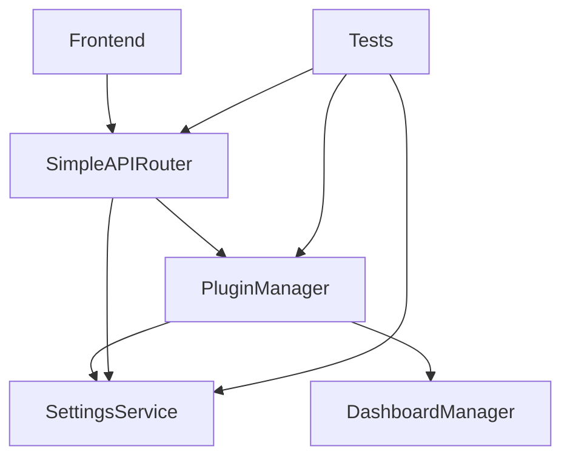

# Design Document

## Overview

This design addresses critical test failures, quality issues, and production readiness problems in the plugin widget integration feature. The system is functionally working but has 30 failing tests (3.3% failure rate) and quality issues that prevent production deployment. The design focuses on fixing these issues systematically while maintaining the existing architecture.

## Architecture

### Current System Architecture
The plugin widget integration follows a modular feature-based architecture:

- **SettingsService**: Manages plugin settings with localStorage persistence
- **PluginManager**: Handles plugin lifecycle and widget registration
- **SimpleAPIRouter**: Provides REST API endpoints for plugin operations
- **DashboardManager**: Manages widget registration and lifecycle

### Integration Points


## Components and Interfaces

### 1. Settings Service Integration Fixes

**Current Issues:**
- Plugin settings not being stored/retrieved correctly (8 failing tests)
- `getPluginSettings()` returns empty objects when settings exist
- `registerPluginSettings()` doesn't properly initialize defaults

**Design Solution:**
- Fix localStorage key management in `buildKey()` method
- Correct plugin settings retrieval logic in `getPluginSettings()`
- Update test expectations to match actual implementation behavior
- Ensure proper default value initialization during registration

**Key Changes:**
```typescript
// Fix plugin settings key building
private buildKey(key: string, userId?: string, pluginId?: string): string {
  if (userId && pluginId) {
    return `${userId}.${pluginId}.${key}`;
  } else if (pluginId) {
    return `${pluginId}.${key}`;  // Fixed: was missing pluginId prefix
  } else if (userId) {
    return `${userId}.${key}`;
  } else {
    return `core.${key}`;
  }
}
```

### 2. Plugin Manager Widget Registration Fixes

**Current Issues:**
- Widget registration called multiple times (3 failing tests)
- Test expectations don't match actual behavior
- Concurrent plugin activation issues

**Design Solution:**
- Implement widget registration deduplication
- Fix test expectations for widget registration lifecycle
- Add proper error handling for concurrent operations

**Key Changes:**
```typescript
// Add widget registration tracking
private registeredWidgets: Set<string> = new Set();

private registerPluginWidgets(plugin: PluginInfo): void {
  const widgetId = `${plugin.id}-widget`;
  if (this.registeredWidgets.has(widgetId)) {
    return; // Prevent duplicate registration
  }
  
  // Register widget and track it
  this.dashboardManager.registerWidget(widget);
  this.registeredWidgets.add(widgetId);
}
```

### 3. API Response Structure Fixes

**Current Issues:**
- API endpoints return inconsistent response structures (1 failing test)
- Frontend integration expects different format

**Design Solution:**
- Standardize API response format across all endpoints
- Update integration tests to match actual response structure

**Standardized Response Format:**
```typescript
interface APIResponse<T = any> {
  success: boolean;
  data?: T;
  message?: string;
  error?: string;
  timestamp: string;
}
```

### 4. Code Quality Improvements

**Current Issues:**
- 38 TODO comments exceed limit of 10
- Console.log statements in production code
- Static asset serving issues
- Error handling gaps

**Design Solution:**
- Remove or resolve all TODO comments
- Replace console.log with structured logging
- Fix static asset serving configuration
- Improve error handling coverage

## Data Models

### Settings Data Model
```typescript
interface Settings {
  key: string;
  value: any;
  type: SettingType;
  userId?: string;
  pluginId?: string;
  validation: ValidationRule[];
  updatedAt: Date;
}
```

### Plugin Widget Model
```typescript
interface DashboardWidget {
  id: string;
  pluginId: string;
  title: string;
  component: string;
  size: WidgetSize;
  permissions: string[];
}
```

## Error Handling

### Settings Service Error Handling
- Graceful degradation when localStorage is unavailable
- Validation error reporting with specific error messages
- Recovery mechanisms for corrupted settings

### Plugin Manager Error Handling
- Plugin activation failure handling without affecting other plugins
- Widget registration error isolation
- Dependency resolution error management

### API Error Handling
- Consistent error response format
- Proper HTTP status codes
- Error logging and monitoring

## Testing Strategy

### Test Categories and Fixes

**Critical Tests (High Priority):**
1. **Settings Service Plugin Integration** (8 tests)
   - Fix plugin settings storage/retrieval
   - Update test expectations to match implementation
   - Add proper mock setup for localStorage

2. **Plugin Manager Widget Registration** (3 tests)
   - Fix duplicate registration prevention
   - Update lifecycle test expectations
   - Add concurrent activation tests

3. **API Integration** (1 test)
   - Fix response structure expectations
   - Update mock responses to match actual format

**Quality Tests (Medium Priority):**
4. **Static Asset Tests** (3 tests)
   - Fix asset serving configuration
   - Update test expectations for asset paths

5. **WebServer Error Handling** (3 tests)
   - Improve error handling coverage
   - Add proper error response testing

**Edge Case Tests (Low Priority):**
6. **JWT Service Tests** (5 tests)
   - Fix authentication edge cases
   - Update token validation logic

7. **Error Boundary Tests** (2 tests)
   - Fix component error handling
   - Update error display expectations

8. **Performance Tests** (1 test)
   - Fix content expectations
   - Update performance monitoring

### Test Infrastructure Improvements
- Proper mock isolation between tests
- Consistent test data setup
- Improved error message assertions
- Better async test handling

## Implementation Plan

### Phase 1: Critical Fixes (Immediate)
1. Fix SettingsService plugin integration
2. Correct PluginManager widget registration logic
3. Update API response structures
4. Fix failing integration tests

### Phase 2: Quality Cleanup (Short-term)
1. Remove TODO comments and console.log statements
2. Fix static asset serving tests
3. Improve error handling tests
4. Update test infrastructure

### Phase 3: Edge Case Fixes (Medium-term)
1. Fix JWT service edge cases
2. Fix error boundary component tests
3. Fix performance monitoring tests
4. Complete test coverage improvements

### Phase 4: Validation (Final)
1. Run complete test suite validation
2. Pass all quality gates
3. Deploy to staging environment
4. Conduct final integration testing

## Security Considerations

- Settings validation to prevent injection attacks
- Plugin isolation to prevent malicious code execution
- API input validation and sanitization
- Secure error message handling (no sensitive data exposure)

## Performance Considerations

- Efficient localStorage operations
- Widget registration deduplication
- Async operation optimization
- Memory leak prevention in event subscriptions

## Migration Strategy

The fixes will be implemented incrementally to minimize risk:

1. **Backward Compatibility**: All fixes maintain existing API contracts
2. **Gradual Rollout**: Critical fixes first, then quality improvements
3. **Testing Validation**: Each phase includes comprehensive test validation
4. **Rollback Plan**: Each change can be reverted independently if issues arise