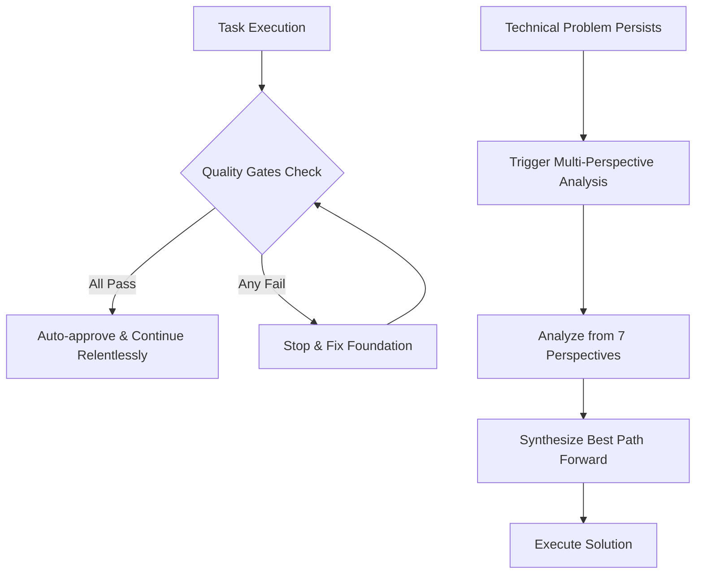

# Status: COMPLETED (2025-01-26)
# Implementation: See .kiro/steering/ directory - quality standards and multi-perspective analysis rules implemented

# Design Document

## Overview

The Relentless Mode Improvement feature updates the existing rule to ensure continuous progress toward PRODUCTION-READY applications with enforced quality gates, and adds a multi-perspective problem-solving steering rule for systematic analysis of persistent technical problems.

## Architecture

### Core Components

1. **Updated Relentless Mode Rule**: Modified rule that auto-approves actions while enforcing quality gates
2. **Multi-Perspective Analysis Steering Rule**: Conditional steering rule that guides systematic problem analysis
3. **Quality Gate Enforcement**: Three critical gates that must pass before proceeding

### System Flow



## Components and Interfaces

### 1. Updated Relentless Mode Rule

**Purpose**: Ensure continuous progress toward production-ready applications with quality enforcement.

**Key Behaviors**:
- Auto-approve actions and proceed without waiting
- Enforce three critical quality gates before proceeding
- Stop and fix foundation when quality gates fail
- Proceed relentlessly when all gates pass

**Quality Gates**:
1. **TypeScript Compilation Gate**: All TypeScript compilation must succeed
2. **Core Test Suite Gate**: Core test suite must maintain >80% pass rate  
3. **Critical Services Gate**: Critical services must have working interfaces

**Design Rationale**: Maintains the "relentless" speed while ensuring production readiness. The three gates are minimal but critical - they catch the most common blockers that would cause production issues.

### 2. Multi-Perspective Analysis Steering Rule

**Purpose**: Provide systematic framework for analyzing persistent technical problems from multiple professional viewpoints.

**Key Structure**:
```markdown
# Multi-Perspective Problem Analysis

When stuck on technical problems, use the 5-7 Perspective Analysis:

## Perspective Framework
1. **PM Perspective** - business impact and priorities
2. **Senior Dev Perspective** - root causes and architecture  
3. **Code Monkey Perspective** - specific fixes and implementation
4. **QA Tester Perspective** - what's breaking and test categories
5. **DevOps Perspective** - build and deployment impact
6. **Tech Lead Perspective** - strategic approach and trade-offs
7. **Architect Perspective** - meta solutions and patterns

## Process
1. Step back from the immediate problem
2. Analyze from each perspective systematically
3. Synthesize the best path forward
```

**Configuration**: 
- Set as manual inclusion steering rule (inclusion: manual)
- Triggered by "#multi-perspective-analysis" context key
- Also triggered automatically when same quality gate fails 3+ times consecutively
- Provides structured methodology for problem analysis

**Design Rationale**: Each perspective brings unique expertise and blind spots. By systematically applying different viewpoints, we can identify solutions that might be missed from a single approach.

## Data Models

### Quality Gate Result
```typescript
interface QualityGateResult {
  typescript: boolean;     // All compilation succeeds
  coreTests: boolean;      // >80% pass rate
  criticalServices: boolean; // Working interfaces
  canProceed: boolean;     // All gates pass
}
```

### Perspective Analysis
```typescript
interface PerspectiveAnalysis {
  perspective: 'PM' | 'SeniorDev' | 'CodeMonkey' | 'QA' | 'DevOps' | 'TechLead' | 'Architect';
  insights: string[];
  recommendations: string[];
}

interface MultiPerspectiveResult {
  problem: string;
  analyses: PerspectiveAnalysis[];
  synthesizedPath: string;
}
```

## Error Handling

### Quality Gate Failures
- **TypeScript Compilation Errors**: Stop immediately, fix compilation issues
- **Core Test Failures**: Stop when pass rate drops below 80%, fix failing tests
- **Critical Service Interface Issues**: Stop immediately, restore working interfaces

### Analysis Framework
- **Graceful Guidance**: Provide clear methodology for each perspective
- **Structured Output**: Ensure consistent analysis format
- **Synthesis Support**: Guide combination of insights into actionable path

## Testing Strategy

### Rule Validation Testing
- **Quality Gate Enforcement**: Test that rule stops on gate failures
- **Auto-approval Behavior**: Test that rule proceeds when gates pass
- **Gate Threshold Testing**: Test 80% pass rate threshold for core tests

### Steering Rule Testing  
- **Perspective Coverage**: Test that all 7 perspectives are addressed
- **Analysis Structure**: Test that analysis follows defined methodology
- **Synthesis Guidance**: Test that insights combine into actionable recommendations

### Integration Testing
- **Rule Interaction**: Test updated relentless mode rule behavior
- **Steering Activation**: Test conditional inclusion of multi-perspective rule
- **End-to-End Flow**: Test complete problem analysis workflow

## Implementation Considerations

### Rule File Updates
- **Relentless Mode Rule**: Update existing `.cursor/rules/` file with new quality gate logic
- **Steering Rule Creation**: Create new `.kiro/steering/` file with multi-perspective framework
- **Conditional Configuration**: Set steering rule for conditional inclusion

### Quality Gate Implementation
- **TypeScript Integration**: Hook into TypeScript compiler API for compilation status
- **Test Runner Integration**: Connect to test framework for pass rate monitoring  
- **Service Health Checks**: Implement interface validation for critical services

### Performance Considerations
- **Fast Gate Checks**: Quality gates should execute quickly to maintain speed
- **Lazy Analysis**: Multi-perspective analysis only when needed
- **Minimal Overhead**: Rule updates should not slow down normal development flow

### Maintainability
- **Clear Rule Structure**: Both rules should be easy to read and modify
- **Documented Methodology**: Multi-perspective framework should be self-explanatory
- **Configurable Thresholds**: Quality gate thresholds should be adjustable