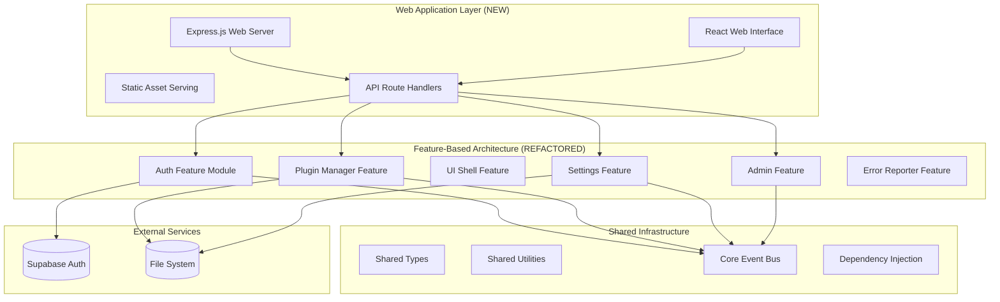

# NeutralApp Foundation Design Document

## Overview

This design document outlines the comprehensive foundation work needed to transform NeutralApp from its current state into a complete, usable web application with proper modular architecture. The design addresses two critical areas: refactoring the existing codebase from technical layer organization to feature-based modular architecture, and building the missing web application layer that makes the system accessible to users.

The current NeutralApp has excellent backend services and comprehensive interfaces, but lacks the web frontend and uses technical layer organization that conflicts with the established architectural principles. This design ensures the system becomes both architecturally sound and functionally complete.

## Architecture

### High-Level System Architecture



### Design Principles

1. **Feature-First Architecture**: Complete refactoring from technical layers to self-contained feature modules
2. **Minimal Web Interface**: Clean, content-focused design following established aesthetic guidelines
3. **Leverage Existing Services**: Build web layer on top of existing, well-tested backend services
4. **Progressive Enhancement**: Start with core functionality, enhance with advanced features
5. **Performance-First**: Optimize for fast loading and smooth interactions
6. **Developer Experience**: Maintain excellent development workflow with hot reloading and testing

## Components and Interfaces

### 1. Modular Architecture Refactoring

**Design Decision**: Complete restructuring from technical layers (`/src/services/`, `/src/interfaces/`) to feature-based modules (`/src/features/{feature-name}/`).

**Rationale**: 
- Current structure violates established architectural principles in steering documents
- Feature-based organization enables plugin conversion with minimal refactoring
- Self-contained features improve maintainability and reduce coupling
- Clear feature boundaries prevent architectural drift

**New Structure**:
```
/src/
  /features/
    /auth/
      /interfaces/     # AuthenticationService, SessionManager interfaces
      /services/       # Existing auth service implementations
      /tests/         # Existing auth tests
      /types/         # Auth-specific types
      /web/           # NEW: Web components and routes
      index.ts        # Feature exports
    
    /plugin-manager/
      /interfaces/     # PluginManager, PluginAPI interfaces
      /services/       # Existing plugin services
      /tests/         # Existing plugin tests
      /types/         # Plugin-specific types
      /web/           # NEW: Plugin management UI
      index.ts
    
    /ui-shell/
      /interfaces/     # Navigation, Layout interfaces
      /services/       # UI framework services
      /tests/         # UI framework tests
      /types/         # UI-specific types
      /web/           # NEW: Navigation and layout components
      index.ts
    
    /settings/
      /interfaces/     # SettingsService interfaces
      /services/       # Existing settings services
      /tests/         # Settings tests
      /types/         # Settings types
      /web/           # NEW: Settings UI components
      index.ts
    
    /admin/
      /interfaces/     # AdminDashboard interfaces
      /services/       # Admin services
      /tests/         # Admin tests
      /types/         # Admin types
      /web/           # NEW: Admin dashboard UI
      index.ts
    
    /error-reporter/
      /interfaces/     # Logging interfaces
      /services/       # Error handling services
      /tests/         # Error handling tests
      /types/         # Error types
      /web/           # NEW: Error display components
      index.ts
  
  /shared/
    /types/           # Cross-feature common types
    /utils/           # Utility functions
    /constants/       # Application constants
  
  /core/
    /event-bus/       # Inter-feature communication
    /dependency-injection/  # DI container
  
  /web/               # NEW: Web application layer
    /server/          # Express.js server setup
    /client/          # React application root
    /shared/          # Shared web utilities
```

**Migration Strategy**:
1. Create new feature directory structure
2. Move existing services, interfaces, tests, and types into appropriate features
3. Update all import statements to use new paths
4. Add new `/web/` subdirectories for UI components
5. Verify each feature is self-contained with clear API boundaries

### 2. Web Server Architecture

**Design Decision**: Express.js server with TypeScript, serving both API endpoints and static React application.

**Rationale**:
- Express.js provides mature, well-documented web server foundation
- TypeScript integration maintains type safety across full stack
- Single server simplifies deployment and development
- API routes can directly use existing service implementations

**Components**:
- `WebServer`: Main Express.js application setup and configuration
- `APIRouter`: Routes that expose existing services as REST endpoints
- `StaticServer`: Serves optimized React application and assets
- `MiddlewareStack`: Authentication, CORS, error handling, and logging middleware

**Key Interfaces**:
```typescript
interface WebServer {
  start(port: number): Promise<void>
  stop(): Promise<void>
  registerAPIRoutes(router: APIRouter): void
  registerMiddleware(middleware: Middleware): void
}

interface APIRouter {
  registerAuthRoutes(authService: AuthenticationService): void
  registerPluginRoutes(pluginService: PluginManager): void
  registerSettingsRoutes(settingsService: SettingsService): void
  registerAdminRoutes(adminService: AdminDashboard): void
}
```

### 3. React Web Application

**Design Decision**: React with TypeScript, following established design guidelines for clean, minimal aesthetics.

**Rationale**:
- React provides mature component-based architecture
- TypeScript ensures type safety and excellent developer experience
- Component structure aligns with feature-based backend architecture
- Established design guidelines ensure consistent, professional appearance

**Design System Implementation**:
- **Color Palette**: Dark navy (#1a1a1a), clean white (#ffffff), medium gray (#6b7280)
- **Typography**: System fonts, generous line heights, clear hierarchy
- **Spacing**: 8px base unit, generous whitespace, centered content areas
- **Components**: Minimal styling, subtle transitions (200-300ms), clean forms
- **Layout**: Sidebar navigation, centered main content, responsive breakpoints

**Component Architecture**:
```typescript
// Feature-based component organization
/src/features/auth/web/
  AuthPage.tsx          # Login/registration page
  LoginForm.tsx         # Clean login form
  RegisterForm.tsx      # Registration form
  AuthGuard.tsx         # Route protection

/src/features/plugin-manager/web/
  PluginManagerPage.tsx # Plugin browsing and management
  PluginCard.tsx        # Individual plugin display
  PluginInstaller.tsx   # Installation interface

/src/features/ui-shell/web/
  AppShell.tsx          # Main application layout
  Navigation.tsx        # Sidebar navigation
  Header.tsx            # Application header
  Layout.tsx            # Responsive layout manager
```

### 4. Authentication Web Interface

**Design Decision**: Clean, minimal authentication forms integrated with existing Supabase AuthenticationService.

**Components**:
- `AuthPage`: Main authentication page with login/register toggle
- `LoginForm`: Clean form with email/password fields and validation
- `RegisterForm`: Registration form with email verification flow
- `AuthGuard`: Route protection component using existing SessionManager
- `AuthProvider`: React context providing authentication state

**Key Features**:
- Form validation with real-time feedback
- Session persistence and automatic refresh
- Destination preservation for expired sessions
- Clean error messaging following design guidelines

### 5. Main Dashboard Interface

**Design Decision**: Plugin-driven dashboard using existing DashboardManager with clean, card-based layout.

**Components**:
- `DashboardPage`: Main dashboard container
- `WelcomeScreen`: Centered welcome for users without plugins
- `WidgetContainer`: Responsive grid for plugin widgets
- `WidgetCard`: Individual plugin widget wrapper with error boundaries

**Key Features**:
- Responsive grid layout with configurable widget sizes
- Graceful degradation when plugin widgets fail
- Drag-and-drop layout customization (future enhancement)
- Clean empty states with clear call-to-action

### 6. Plugin Management Interface

**Design Decision**: Clean plugin marketplace interface using existing PluginManager service.

**Components**:
- `PluginManagerPage`: Main plugin management interface
- `PluginGrid`: Grid layout for available plugins
- `PluginCard`: Individual plugin display with ratings and description
- `PluginInstaller`: Installation progress and confirmation
- `InstalledPluginsList`: Management of installed plugins

**Key Features**:
- Search and filtering capabilities
- Plugin ratings and reviews display
- Installation progress indicators
- Enable/disable toggle switches
- Uninstall confirmation dialogs

### 7. Settings Interface

**Design Decision**: Hierarchical settings interface using existing SettingsService with clean form organization.

**Components**:
- `SettingsPage`: Main settings container with navigation
- `SettingsSection`: Grouped settings with clear visual hierarchy
- `SettingField`: Individual setting input with validation
- `PluginSettings`: Dynamic plugin-specific settings integration

**Key Features**:
- Real-time validation and saving
- Clear visual grouping of related settings
- Plugin settings automatically integrated
- Reset to defaults with confirmation
- Clean form styling with subtle focus states

### 8. Admin Dashboard Interface

**Design Decision**: Comprehensive admin interface using existing AdminDashboard service with data visualization.

**Components**:
- `AdminDashboardPage`: Main admin interface
- `SystemHealthCard`: System metrics display
- `UserManagementPanel`: User profile viewing and actions
- `PluginHealthMonitor`: Plugin status and performance metrics
- `LogViewer`: Searchable, filterable log interface

**Key Features**:
- Real-time system health monitoring
- Clean data visualization with charts and metrics
- User management with administrative actions
- Plugin health status with color-coded indicators
- Comprehensive log search and filtering

## Data Models

### Web-Specific Models

```typescript
// API Response Models
interface APIResponse<T> {
  success: boolean
  data?: T
  error?: string
  timestamp: Date
}

// UI State Models
interface UIState {
  loading: boolean
  error: string | null
  user: User | null
  theme: 'light' | 'dark'
}

// Component Props Models
interface PageProps {
  title: string
  loading?: boolean
  error?: string
  children: React.ReactNode
}
```

### Existing Models (Maintained)
All existing data models from the current implementation remain unchanged:
- User, Plugin, Settings, LogEntry models
- Service interfaces and types
- Error handling and validation models

## Error Handling

### Web-Specific Error Handling

**Design Decision**: Comprehensive error handling system that provides graceful user experience while maintaining complete error traceability for developers.

**Rationale**: 
- Users need clear, actionable feedback without technical details
- Developers need complete error context for debugging and monitoring
- System stability must be maintained even when individual components fail
- All errors must be automatically captured and accessible through dashboards

**Error Display Strategy**:
- **Inline Errors**: Form validation and field-specific errors with subtle styling
- **Toast Notifications**: Success confirmations and non-critical errors with clean design
- **Error Boundaries**: Component-level error containment with graceful fallback UI
- **Fallback UI**: Clean, minimal error states that maintain application aesthetics
- **Network Status**: Subtle connectivity indicators without intrusive notifications
- **Loading States**: Clean loading indicators without distracting animations

**Error Categories**:
1. **Network Errors**: API communication failures with retry options and clear recovery paths
2. **Validation Errors**: Form input validation with real-time feedback and helpful guidance
3. **Authentication Errors**: Login/session errors with destination preservation and clear recovery
4. **Component Errors**: React component failures with error boundaries and graceful degradation
5. **Plugin Errors**: Plugin-specific failures that don't affect core functionality
6. **System Errors**: Critical system failures with stability maintenance and admin notification

### Integration with Existing Error System
- **Complete Error Capture**: Every error automatically captured and traceable without manual investigation
- **Dashboard Integration**: All errors accessible via admin dashboard without console debugging required
- **Structured Logging**: Full context, stack traces, and recovery suggestions for all errors
- **Error Aggregation**: Both backend and frontend errors collected and analyzed
- **Real-time Monitoring**: Live error tracking with performance impact analysis
- **User Context**: Error logging includes user actions, component state, and session information
- **Plugin Isolation**: Plugin errors contained and reported without affecting core system

## Testing Strategy

### Web Application Testing

**Testing Levels**:
1. **Component Tests**: React component unit tests with React Testing Library
2. **Integration Tests**: API integration and user workflow tests
3. **E2E Tests**: Complete user scenarios with Playwright
4. **Visual Regression Tests**: UI consistency and responsive design tests

**Testing Tools**:
- **Jest**: Unit testing for components and utilities
- **React Testing Library**: Component testing with user-focused approach
- **Playwright**: End-to-end testing for complete user workflows
- **Storybook**: Component development and visual testing

### Integration with Existing Tests
- Existing service tests remain unchanged and continue to run
- New web tests complement existing backend test coverage
- CI/CD pipeline runs both backend and frontend test suites
- Test coverage includes both service layer and web interface

### Documentation Alignment Strategy

**Design Decision**: Ensure all documentation sources maintain clear separation of concerns and consistent messaging.

**Rationale**:
- Prevents confusion from overlapping or conflicting information
- Creates clear learning paths for different user types
- Maintains single source of truth for each type of information
- Supports efficient onboarding and development workflows

**Documentation Hierarchy**:
- **README.md**: Project overview, getting started, basic usage
- **Specs**: Detailed requirements, design decisions, implementation tasks
- **Steering**: Implementation guidelines, architectural principles, coding standards
- **Rules**: Development process enforcement, workflow rules, quality gates

**Consistency Requirements**:
- All sources must consistently reference feature-based modular architecture
- Design guidelines must align across all documentation
- No conflicting information between sources
- Clear cross-references without content duplication

## Performance Considerations

### Web Performance Optimization

**Loading Performance**:
- Code splitting by feature modules for faster initial load
- Lazy loading of non-critical components and routes
- Optimized bundle sizes with tree shaking and minification
- Static asset optimization with compression and caching headers
- **Target**: Application loads within 3 seconds on standard connections

**Runtime Performance**:
- React.memo for expensive component renders
- Debounced user input handling (especially for search and settings)
- Efficient state management with minimal re-renders
- Virtual scrolling for large data sets (plugin lists, logs)
- **Target**: Component interactions respond within 200ms

**Network Performance**:
- API response caching where appropriate
- Optimistic UI updates for better perceived performance
- Efficient data fetching with proper loading states
- Minimal API calls through smart data management
- Pagination and lazy loading for large datasets

**Performance Monitoring**:
- Real-time performance metrics collection
- Performance degradation detection and alerting
- User experience monitoring with Core Web Vitals
- Performance dashboard integration for admin interface

## Development Workflow

### Development Environment Setup

**Design Decision**: Modern development environment with comprehensive tooling for efficient development and deployment workflows.

**Rationale**:
- Hot reloading enables rapid development iteration
- TypeScript strict mode ensures type safety across full stack
- Automated quality checks prevent issues from reaching production
- Concurrent development of frontend and backend improves developer productivity

**Hot Reloading**:
- React development server with fast refresh for instant UI updates
- Backend API server with nodemon for automatic restarts on code changes
- Concurrent development of frontend and backend with proxy configuration
- Live reload for CSS and static assets without full page refresh

**Build Process**:
- TypeScript compilation for both frontend and backend with strict mode
- React build optimization for production with code splitting and minification
- Asset bundling and optimization with modern web standards support
- Environment-specific configuration management for development, staging, and production
- Source map generation for debugging in development

**Quality Assurance**:
- ESLint and Prettier for consistent code formatting and style
- TypeScript strict mode for comprehensive type checking
- Pre-commit hooks for automated code quality checks
- Automated testing in CI/CD pipeline with quality gates
- Build failure prevention for code that doesn't meet quality standards

### Testing Strategy Integration

**Comprehensive Testing Levels**:
- **Unit Tests**: All functions and components with meaningful coverage
- **Integration Tests**: API endpoints and service interactions
- **End-to-End Tests**: Real-world user scenarios with headless browsers
- **Visual Regression Tests**: UI consistency across devices and browsers

**Quality Gates**:
- All tests must pass before deployment
- No TODOs allowed in production code
- Complete error handling for all failure modes
- All acceptance criteria must be verifiable through tests

## Quality Assurance and System Audit

### Complete System Quality Audit

**Design Decision**: Implement comprehensive quality verification process to ensure production readiness and maintainability.

**Rationale**:
- Systematic quality verification prevents production issues
- Comprehensive testing ensures all functionality works as specified
- Documentation alignment prevents developer confusion and onboarding issues
- Architecture validation ensures long-term maintainability and plugin readiness

**Quality Verification Process**:
1. **Test Coverage Audit**: Verify all tests pass (unit, integration, e2e) with meaningful coverage
2. **Code Quality Review**: Ensure no TODOs, complete error handling, and all acceptance criteria met
3. **Documentation Synchronization**: Confirm README, specs, steering, and rules are aligned and consistent
4. **Functional Validation**: Demonstrate end-to-end application functionality with all features operational
5. **Architecture Compliance**: Validate proper feature-based organization and plugin-ready structure
6. **Performance Verification**: Confirm application meets performance targets (3s load, 200ms interactions)

**Quality Standards**:
- **Zero Tolerance for Incomplete Features**: All functionality must be fully implemented
- **Complete Error Handling**: Every error path must be tested and handled gracefully
- **Documentation Consistency**: No conflicting information across documentation sources
- **Architecture Compliance**: Strict adherence to feature-based modular organization
- **Performance Standards**: Meet specified load times and interaction response targets

## Migration and Deployment

### Migration Strategy

**Phase 1: Architecture Refactoring**
1. Create new feature-based directory structure
2. Move existing code into appropriate feature modules
3. Update import statements and dependencies
4. Verify all existing tests pass with new structure

**Phase 2: Web Application Development**
1. Set up Express.js server with API routes
2. Create React application shell and routing
3. Implement authentication interface
4. Build core dashboard and navigation

**Phase 3: Feature Interface Development**
1. Implement plugin management interface
2. Build settings management interface
3. Create admin dashboard interface
4. Add responsive design and mobile support

**Phase 4: Testing and Optimization**
1. Comprehensive testing of all interfaces
2. Performance optimization and monitoring
3. Documentation updates and alignment
4. Production deployment preparation

### Deployment Considerations

**Production Build**:
- Optimized React build with minification
- Server-side rendering considerations for SEO
- Environment variable management
- Database migration and setup scripts

**Monitoring and Maintenance**:
- Application performance monitoring
- Error tracking and alerting
- User analytics and usage patterns
- Regular security updates and maintenance

## Demo Plugin Architecture

### Demo Plugin Design

**Design Decision**: Create a comprehensive "Hello World" demo plugin that showcases all plugin system capabilities.

**Rationale**:
- Validates plugin architecture works end-to-end
- Provides reference implementation for future plugin developers
- Tests plugin sandboxing and security boundaries
- Demonstrates plugin integration with core systems

**Demo Plugin Components**:
- **Plugin Manifest**: Complete metadata with dependencies and permissions
- **Dashboard Widget**: Simple widget displaying plugin status and data
- **Settings Panel**: Plugin-specific configuration options
- **API Integration**: Secure communication with core services
- **Error Handling**: Graceful failure modes and recovery

**Key Features**:
- Plugin lifecycle management (install, activate, deactivate, uninstall)
- Settings persistence through core SettingsService
- Event system integration for inter-plugin communication
- Secure API boundaries with proper permission handling
- Comprehensive test coverage (unit, integration, e2e)

### Plugin System Validation

**Integration Testing**:
- Plugin installation and removal processes
- Settings integration and persistence
- Dashboard widget rendering and interaction
- Error boundary testing and graceful degradation
- Security boundary validation and sandboxing

**Documentation and Examples**:
- Complete plugin development guide
- API reference with code examples
- Best practices for plugin architecture
- Security guidelines for plugin developers
- Testing strategies for plugin validation