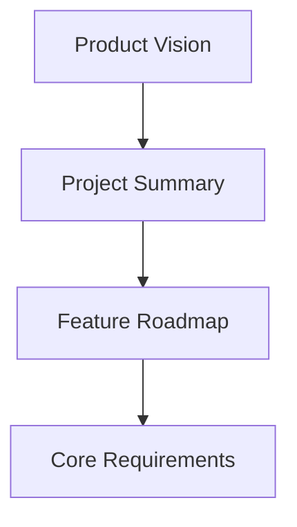

# Product Requirements Document (PRD) Design

## Overview

This design outlines a focused PRD structure for NeutralApp that covers the essential elements: product vision, project summary, feature roadmap, and core requirements. The PRD will be concise and actionable, following standard industry format while avoiding unnecessary complexity.

## Architecture

### Simple PRD Structure



### Document Sections

1. **Product Vision**: Clear statement of what NeutralApp is and why it matters
2. **Project Summary**: Current state, technology stack, and key decisions
3. **Feature Roadmap**: Phased development plan with priorities
4. **Core Requirements**: Essential platform capabilities and constraints

## Components and Interfaces

### 1. Product Vision Section

**Content Elements**:
- One-sentence vision statement
- Value proposition for key users (developers, AI agents, plugin authors, end users)
- Key differentiators from existing solutions
- Success definition

### 2. Project Summary Section

**Content Elements**:
- Current implementation status
- Technology stack and architectural approach
- Key design decisions and rationale
- Scope boundaries (what's in core vs plugins)

### 3. Feature Roadmap Section

**Content Elements**:
- **Foundation**: Core platform, auth, basic UI
- **MVP**: Plugin system, settings, admin
- **V1**: Marketplace, advanced features
- **Future**: Long-term vision items
- Prioritization criteria and rationale

### 4. Core Requirements Section

**Content Elements**:
- Authentication and user management
- Plugin system capabilities
- UI/UX requirements
- Admin and monitoring features
- Performance and reliability targets

## Data Models

### PRD Content Structure

```typescript
interface PRDContent {
  vision: ProductVision
  summary: ProjectSummary
  roadmap: FeatureRoadmap
  requirements: CoreRequirements
}

interface ProductVision {
  statement: string
  valueProps: string[]
  differentiators: string[]
  targetUsers: string[]
}

interface FeatureRoadmap {
  foundation: Feature[]
  mvp: Feature[]
  v1: Feature[]
  future: Feature[]
}
```

## Error Handling

### Content Quality Assurance

- Ensure all sections are complete and consistent
- Verify requirements are specific and measurable
- Confirm roadmap aligns with vision and requirements
- Validate technical feasibility with development team

## Testing Strategy

### PRD Validation

- Review with stakeholders for completeness
- Technical review for implementation feasibility
- Alignment check between all sections
- Regular updates as product evolves